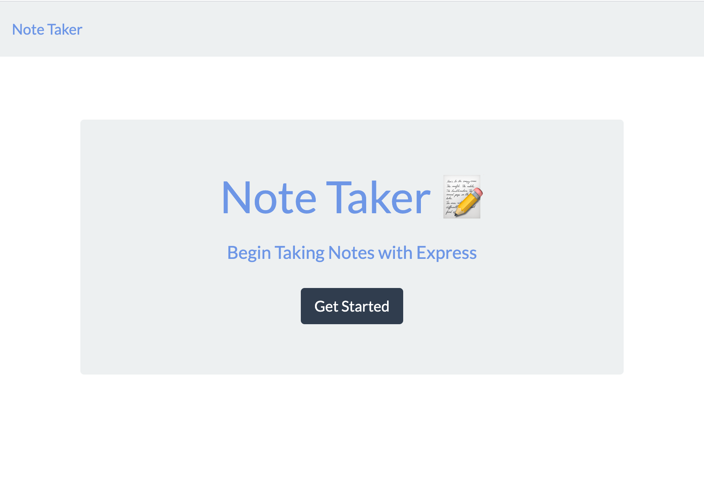
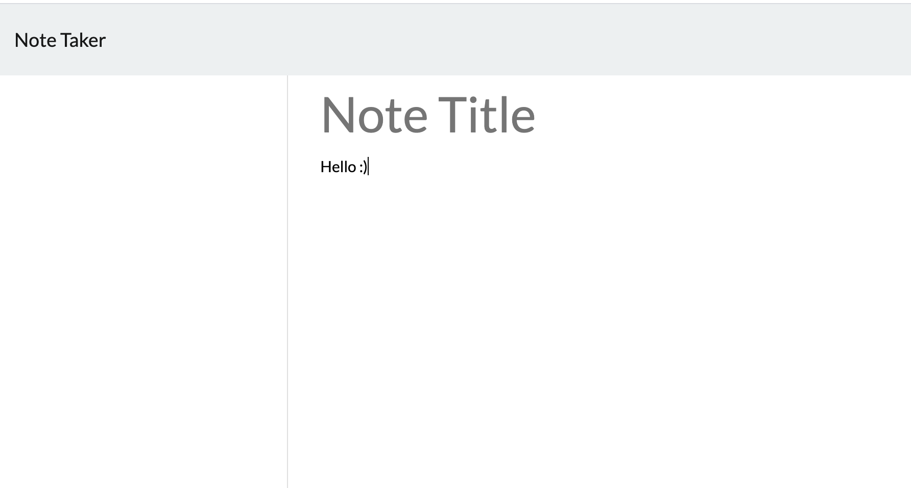

# Welcome to NoteTakerApp !
## Description :
* This app was created to be able to let the user take notes and be used to write, save, and delete your notes. 
* This application will uses express backend and save and retrieve note data from a JSON file.
## The website was developed in:
* HTML
* Java
* CSS
* JSON
* API

## Here are examples of the app:

